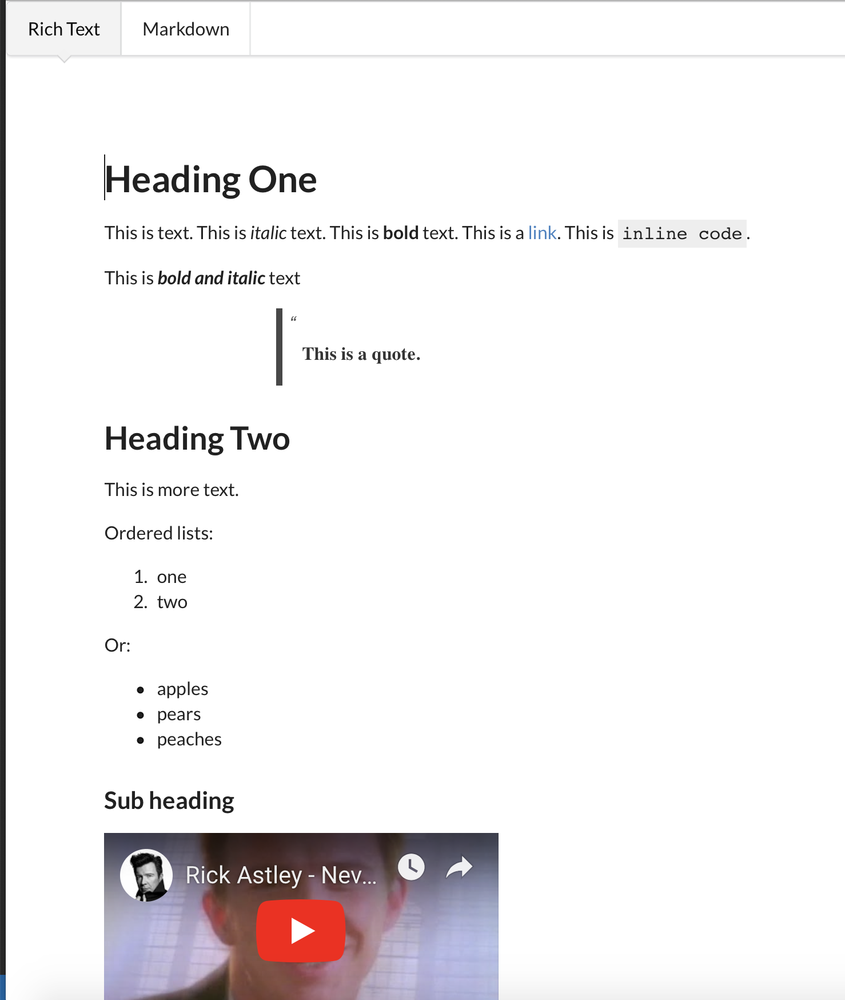

<h1 align="center">
  Markdown Editor
</h1>

<p align="center">

   <a href="https://accordproject-markdown-editor.netlify.com/examples/">
      
   </a>
   <a href="https://travis-ci.org/accordproject/markdown-editor">
      
   </a>

   <a href="https://www.npmjs.com/package/@accordproject/markdown-editor">
      
   </a>
 
   <a href="https://badge.fury.io/js/%40accordproject%2Fmarkdown-editor">
      
   </a>
   
   <a href="https://github.com/accordproject/markdown-editor/blob/master/LICENSE">
      
   </a>

  <a href="https://accord-project-slack-signup.herokuapp.com/">
    
  </a>
 
</p>

This repo contains two React-based editors:
1. A WYSIWYG  [Slate][slate]-based editor that edits rich text and calls an `onChange`
   callback with the modified Slate DOM.
2. A TextArea-based markdown editor that edits markdown text and calls an `onChange`
   callback with the modified markdown text.

The demo editor uses the `markdown-transform` package to transform Slate DOM 
to/from markdown text.

Using these editors you could allow people to either edit rich formatted text using
markdown (and provide a WYSIWYG preview), or allow them to edit using a WYSIWYG
editor and use markdown for persistence.

The editor includes a formatting toolbar.

This component is Apache-2 licensed Open Source. Contributors welcome!

### [Demo](https://accordproject-markdown-editor.netlify.com/examples/)

### Usage

```
npm install @accordproject/markdown-editor
```

```
import { SlateAsInputEditor } from '@accordproject/markdown-editor';
import List from '@accordproject/markdown-editor/dist/plugins/list';
import Video from '@accordproject/markdown-editor/dist/plugins/video';
import { SlateTransformer } from '@accordproject/markdown-slate';

const plugins = [List()];
const slateTransformer = new SlateTransformer();

function storeLocal(slateValue) {
  const markdown = slateTransformer.toMarkdown(slateValue);
  localStorage.setItem('markdown-editor', markdown);
}

ReactDOM.render(<SlateAsInputEditor plugins={plugins} lockText={false} onChange={storeLocal}/>
, document.getElementById('root'));
```

### Example

For an example React App see the `./examples/` folder.

A `TextArea` containing [CommonMark][CommonMark] synchronized with a `MarkdownEditor` component, rendered using [Slate][slate].



In order to run an isolated local development example, run `npm run dev` and then navigate to http://localhost:3001/examples

## Available Scripts

In the project directory, you can run:

#### `npm run dev`

Runs the app in the development mode.<br>
Open [http://localhost:3001/examples](http://localhost:3001/examples) to view it in the browser.

The page will reload if you make edits.<br>

#### `npm run build`

Builds the app for production to the `build` folder.<br>
It correctly bundles React in production mode and optimizes the build for the best performance.

The build is minified and the filenames include the hashes.<br>
Your app is ready to be deployed!

## Styling

You can style the toolbar of this component, as well as the width of the editor:

#### `editorProps`

This is an object with the following possible css inputs as strings:
- `BUTTON_BACKGROUND_INACTIVE`
- `BUTTON_BACKGROUND_ACTIVE`
- `BUTTON_SYMBOL_INACTIVE`
- `BUTTON_SYMBOL_ACTIVE`
- `DROPDOWN_COLOR`
- `TOOLBAR_BACKGROUND`
- `EDITOR_BORDER_RADIUS`
- `EDITOR_SHADOW`
- `EDITOR_BORDER`
- `TOOLTIP_BACKGROUND`
- `TOOLTIP`
- `TOOLBAR_SHADOW`
- `WIDTH`

---

<p align="center">
  <a href="https://www.accordproject.org/">
    
  </a>
</p>

Accord Project is an open source, a non-profit, initiative working to transform contract management and contract automation by digitizing contracts. Accord Project operates under the umbrella of the [Linux Foundation][linuxfound]. The technical charter for the Accord Project can be found [here][charter].

## Learn More About Accord Project

### Overview
* [Accord Project][apmain]
* [Accord Project News][apnews]
* [Accord Project Blog][apblog]
* [Accord Project Slack][apslack]
* [Accord Project Technical Documentation][apdoc]
* [Accord Project GitHub][apgit]


### Documentation
* [Getting Started with Accord Project][docwelcome]
* [Concepts and High-level Architecture][dochighlevel]
* [How to use the Cicero Templating System][doccicero]
* [How to Author Accord Project Templates][docstudio]
* [Ergo Language Guide][docergo]

### Ecosystem


#### Core libraries:
<table>
  <tr>
    <th headers="blank">Projects</th>
    <th headers="blank">Package name</th>
    <th headers="blank">Version</th>
    <th headers="blank">Description</th>
  </tr>
  <tr>
    <td headers><a href="https://github.com/accordproject/cicero">Cicero</a></td>
    <td headers> <a href="https://github.com/accordproject/cicero/tree/master/packages/cicero-core">cicero-core</a></td>
    <td headers> <a href="https://badge.fury.io/js/%40accordproject%2Fcicero-core"></a></td>
    <td headers>Templates Core</td>
  </tr>
    <tr>
      <td headers></td>
    <td headers> <a href="https://github.com/accordproject/cicero/tree/master/packages/cicero-cli">cicero-cli</a></td>
      <td headers> <a href="https://badge.fury.io/js/%40accordproject%2Fcicero-cli"></a></td>
      <td headers> Cicero CLI </td>
    </tr>
    <tr>
    <td headers></td>
    <td headers> <a href="https://github.com/accordproject/cicero/tree/master/packages/cicero-engine">cicero-engine</a></td>
    <td headers> <a href="https://badge.fury.io/js/%40accordproject%2Fcicero-engine"></a></td>
    <td headers>Node.js VM based implementation of Accord Protcol Template Specification execution</td>
    </tr>
    <tr>
    <td headers></td>
    <td headers> <a href="https://github.com/accordproject/cicero/tree/master/packages/cicero-server">cicero-server</a></td>
    <td headers> <a href="https://badge.fury.io/js/%40accordproject%2Fcicero-server"></a></td>
    <td headers>Wraps the Cicero Engine and exposes it as a RESTful service<td>
    </tr>
    <tr>
    <td headers></td>
    <td headers> <a href="https://github.com/accordproject/cicero/tree/master/packages/cicero-test">cicero-test</a></td>
    <td headers> <a href="https://badge.fury.io/js/%40accordproject%2Fcicero-test"></a></td>
    <td headers> Testing support for Cicero based on cucumber</td>
    </tr>
     <tr>
     <td headers></td>
     <td headers> <a href="https://github.com/accordproject/cicero/tree/master/packages/cicero-tools">cicero-tools</a></td>
     <td headers> <a href="https://badge.fury.io/js/%40accordproject%2Fcicero-tools"></a></td>
     <td headers>Cicero Tools</td>
     </tr>
      <tr>
      <td headers="co1 c1"></td>
      <td headers="co2 c1"> <a href="https://github.com/accordproject/cicero/tree/master/packages/generator-cicero-template">generator-cicero-template</a></td>
      <td headers="co3 c1"> <a href="https://badge.fury.io/js/%40accordproject%2Fgenerator-cicero-template"></a></td>
      <td headers="co4 c1">Code generator for a Cicero Template</td>
      </tr>
      <tr>
      <td headers><a href="https://github.com/accordproject/concerto">Concerto</a></td>
      <td headers><a href="https://github.com/accordproject/concerto/tree/master/packages/concerto-core">concerto-core</a></td>
      <td headers> <a href="https://badge.fury.io/js/%40accordproject%2Fconcerto-core"></a></td>
      <td headers> Core Implementation for the Concerto Modeling Language</td>
      </tr>
      <tr>
      <td headers></td>
      <td headers><a href="https://github.com/accordproject/concerto/tree/master/packages/concerto-tools">concerto-tools</a></td>
      <td headers> <a href="https://badge.fury.io/js/%40accordproject%2Fconcerto-tools"></a></td>
      <td headers> Tools for the Concerto Modeling Language</td>
  </tr>
  <tr>
   <td headers></td>
   <td headers><a href="https://github.com/accordproject/concerto/tree/master/packages/concerto-cli">concerto-cli</a></td>
   <td headers> <a href="https://badge.fury.io/js/%40accordproject%2Fconcerto-cli"></a></td>
   <td headers>command-line interface for Concerto</td>
  </tr>
  <tr>
    <td headers><a href="https://github.com/accordproject/ergo">Ergo</a></td>
    <td headers><a href="https://github.com/accordproject/ergo/tree/master/packages/ergo-cli">ergo-cli</a></td>
    <td headers><a href="https://badge.fury.io/js/%40accordproject%2Fergo-cli"></a></td>
    <td headers>Ergo CLI</td>
  </tr>
  <tr>
    <th id="blank"></th>
    <td headers><a href="https://github.com/accordproject/ergo/tree/master/packages/ergo-compiler">ergo-compiler</a></td>
    <td headers><a href="https://badge.fury.io/js/%40accordproject%2Fergo-compiler"></a></td>
    <td headers>Ergo compiler</td>
  </tr>
  <tr>
   <th id="blank"></th>
   <td headers><a href="https://github.com/accordproject/ergo/tree/master/packages/ergo-test">ergo-test</a></td>
   <td headers><a href="https://badge.fury.io/js/%40accordproject%2ergo-test"></a></td>
   <td headers>Ergo test</td>
   </tr>
    <tr>
    <th id="blank"></th>
    <td headers><a href="https://github.com/accordproject/ergo/tree/master/packages/ergo-engine">ergo-engine</a></td>
    <td headers><a href="https://badge.fury.io/js/%40accordproject%2Fergo-engine"></a></td>
    <td headers>Ergo engine</td>
    </tr>
    <tr>
     <td headers><a href="https://docs.accordproject.org/docs/next/markup-cicero.html">Markdown</a></td>
     <td headers><a href="https://github.com/accordproject/markdown-transform/tree/master/packages/markdown-common">markdown-common</a></td>
     <td headers><a href="https://badge.fury.io/js/%40accordproject%2Fmarkdown-common"></a></td>
     <td headers>A framework for transforming markdown</td>
    </tr>
     <tr>
     <th id="blank"></th>
     <td headers><a href="https://github.com/accordproject/markdown-transform/tree/master/packages/markdown-slate">markdown-slate</a></td>
     <td headers><a href="https://badge.fury.io/js/%40accordproject%2Fmarkdown-slate"></a></td>
     <td headers>Transform markdown to/from CommonMark DOM</td>
     </tr>
     <tr>
     <td headers></td>
     <td headers><a href="https://github.com/accordproject/markdown-transform/tree/master/packages/markdown-cli"> markdown-cli </a></td>
     <td headers> <a href="https://badge.fury.io/js/%40accordproject%2Fmarkdown-cli"></a></td>
     <td headers> CLI for markdown transformations.</td>
    </tr>
     <tr>
      <th id="blank"></th>
      <td headers><a href="https://github.com/accordproject/markdown-transform/tree/master/packages/markdown-cicero">markdown-cicero</a></td>
      <td headers><a href="https://badge.fury.io/js/%40accordproject%2Fmarkdown-cicero"></a></td>
      <td headers>CiceroDOM: Markdown extensions for contracts, clauses, variables etc.</td>
      </tr>
       <tr>
      <th id="blank"></th>
       <td headers><a href="https://github.com/accordproject/markdown-transform/tree/master/packages/markdown-html">markdown-html</a></td>
       <td headers><a href="https://badge.fury.io/js/%40accordproject%2Fmarkdown-html"></a></td>
       <td headers>Transform CiceroDOM to HTML</td>
       </tr>
 
</table>

#### UI Components:

<table>
  <tr>
    <th  headers="blank">Projects</th>
    <th  headers="blank">Package name</th>
    <th  headers="blank">Version</th>
    <th  headers="blank">Description</th>
  </tr>
    <tr>
      <td headers>Markdown Editor</td>
      <td headers><a href="https://github.com/accordproject/markdown-editor">markdown-editor</a></td>
      <td headers> <a href="https://badge.fury.io/js/%40accordproject%2Fmarkdown-editor">
      </a></td>
      <td headers>WYSIWYG rich text web editor that persists text as markdown. Based on Slate.js</td>
    </tr>
     <tr>
     <td headers="co1 c1">Cicero UI</td>
      <td headers="co2 c1"><a href="https://github.com/accordproject/cicero-ui">cicero-ui</a></td>
      <td headers="co3 c1"> <a href="https://badge.fury.io/js/%40accordproject%2Fcicero-ui"></a></td>
       <td headers="co4 c1">WYSIWYG contract editor, template libary browser, error panel component</td>
     </tr>
     <tr>
     <td headers="co1 c1">Concerto UI</td>
      <td headers="co2 c1"><a href="https://github.com/accordproject/concerto-ui">concerto-ui</a></td>
      <td headers="co3 c1"> <a href="https://badge.fury.io/js/%40accordproject%2Fconcerto-ui-react"></a></td>
       <td headers="co4 c1">Dynamic web forms generated from Concerto models</td>
     </tr>
</table>
  

#### Template Editors:

<table>
  <tr>
    <th headers="blank">Projects</th>
    <th headers="blank">Cicero ver.</th>
    <th headers="blank">Description</th>
  </tr>
  <tr>
    <td headers><a href="https://github.com/accordproject/template-studio">Template Studio v1</a></td>
    <td headers> <b>0.13.4</b></td>
    <td headers>Web UI for creating, editing and testing Accord Project templates</td>
  </tr>
  <tr>
    <td headers><a href="https://github.com/accordproject/template-studio-v2">Template Studio v2</a></td>
    <td headers> <b>0.13.4</b></td>
    <td headers>Web UI for creating, editing and testing Accord Project templates</td>
  </tr>
   <tr>
    <td headers><a href="https://github.com/accordproject/cicero-vscode-extension">VSCode Extension</a></td>
    <td headers><b>0.13.4</b></td>
    <td headers>VS Code extension for editing Cicero templates and Ergo logic</td>
   </tr>
</table>


#### Public templates and models:

<table>
  <tr>
    <th headers="blank">Projects</th>
    <th headers="blank">Description</th>
  </tr>
  <tr>
    <td headers><a href="https://github.com/accordproject/models">Models</a></td>
    <td headers>Accord Project Model Library </td>
  </tr>
   <tr>
     <td headers><a href="https://github.com/accordproject/cicero-template-library">Template Library</a></td>
     <td headers>Accord Project Template Library </td>
   </tr>
 
</table>


#### Documentation:

<table>
  <tr>
    <th headers="blank">Project</th>
    <th headers="blank">Repo</th>
  </tr>
  <tr>
    <td headers><a href="https://docs.accordproject.org/">Documentation</a></td>
    <td headers><a href="https://github.com/accordproject/techdocs">techdocs</a></td>
  </tr>
 </table>

## Contributing

The Accord Project technology is being developed as open source. All the software packages are being actively maintained on GitHub and we encourage organizations and individuals to contribute requirements, documentation, issues, new templates, and code.

Find out what’s coming on our [blog][apblog].

Join the Accord Project Technology Working Group [Slack channel][apslack] to get involved!

For code contributions, read our [CONTRIBUTING guide][contributing] and information for [DEVELOPERS][developers].

## License <a name="license"></a>

Accord Project source code files are made available under the [Apache License, Version 2.0][apache].
Accord Project documentation files are made available under the [Creative Commons Attribution 4.0 International License][creativecommons] (CC-BY-4.0).

[CommonMark]: https://commonmark.org
[slate]: https://docs.slatejs.org/

[linuxfound]: https://www.linuxfoundation.org
[charter]: https://github.com/accordproject/markdown-editor/blob/master/CHARTER.md
[apmain]: https://accordproject.org/ 
[apworkgroup]: https://calendar.google.com/calendar/event?action=TEMPLATE&tmeid=MjZvYzIzZHVrYnI1aDVzbjZnMHJqYmtwaGlfMjAxNzExMTVUMjEwMDAwWiBkYW5AY2xhdXNlLmlv&tmsrc=dan%40clause.io
[apblog]: https://medium.com/@accordhq
[apnews]: https://www.accordproject.org/news/
[apgit]:  https://github.com/accordproject/
[apdoc]: https://docs.accordproject.org/
[apslack]: https://accord-project-slack-signup.herokuapp.com

[docspec]: https://docs.accordproject.org/docs/spec-overview.html
[docwelcome]: https://docs.accordproject.org/docs/accordproject.html
[dochighlevel]: https://docs.accordproject.org/docs/spec-concepts.html
[docergo]: https://docs.accordproject.org/docs/logic-ergo.html
[docstart]: https://docs.accordproject.org/docs/accordproject.html
[doccicero]: https://docs.accordproject.org/docs/basic-use.html
[docstudio]: https://docs.accordproject.org/docs/advanced-latedelivery.html

[contributing]: https://github.com/accordproject/markdown-editor/blob/master/CONTRIBUTING.md
[developers]: https://github.com/accordproject/markdown-editor/blob/master/DEVELOPERS.md

[apache]: https://github.com/accordproject/markdown-editor/blob/master/LICENSE
[creativecommons]: http://creativecommons.org/licenses/by/4.0/
