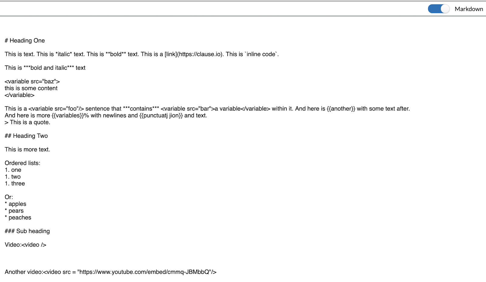

This is a React component for a rich text editor that can read and write [CommonMark](https://commonmark.org) Markdown text. The editor uses [Slate.js](https://slatejs.org).

The editor is plugin based and includes a pop-up formatting toolbar.

This component is Apache-2 licensed Open Source. Contributors welcome!

### Demo

https://accordproject-markdown-editor.netlify.com/examples/

### Usage

```
npm install @accordproject/markdown-editor
```

```
import { MarkdownEditor } from '@accordproject/markdown-editor';

import List from '../../src/plugins/list';
import Video from '../../src/plugins/video';

const plugins = [List(), Video()];

function storeLocal(editor) {
  localStorage.setItem('markdown-editor', editor.getMarkdown());
}

ReactDOM.render(<MarkdownEditor plugins={plugins} onChange={storeLocal} />, document.getElementById('root'));
```

### Example

For an example React App see the ./examples/ folder.

A `TextArea` containing CommonMark synchronized with a `MarkdownEditor` component, rendered using Slate.js.

The code for the sample `video` plugin used in the demo is here:
https://github.com/accordproject/markdown-editor/blob/master/src/plugins/video.js




Run `npm start` and then navigate to: http://localhost:3001/examples

## Available Scripts

In the project directory, you can run:

### `npm start`

Runs the app in the development mode.<br>
Open [http://localhost:3001](http://localhost:3001) to view it in the browser.

The page will reload if you make edits.<br>

### `npm run build`

Builds the app for production to the `build` folder.<br>
It correctly bundles React in production mode and optimizes the build for the best performance.

The build is minified and the filenames include the hashes.<br>
Your app is ready to be deployed!
